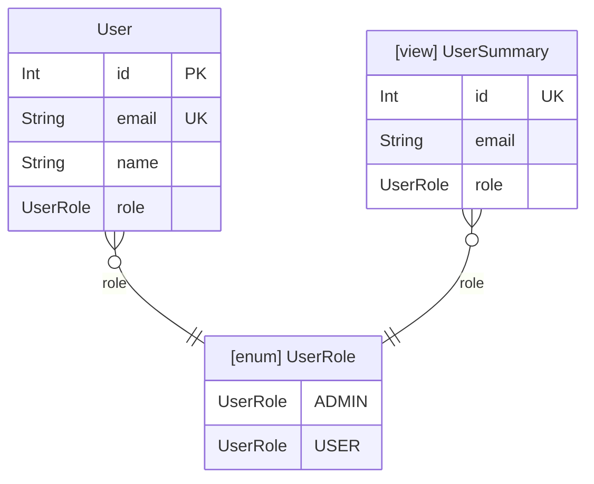

# prisma-neighbourhood

Generate focused ERD diagrams from Prisma schemas by traversing relationships from any entity (model, view, or enum) to a configurable depth.

[](https://github.com/Matserdam/prisma-neighbourhood/actions/workflows/ci.yml)

[](https://github.com/Matserdam/prisma-neighbourhood/actions/workflows/release.yml)

## Why?

Large Prisma schemas with `>10` models produce overwhelming ERDs. `prisma-neighbourhood` lets you visualize just the "neighborhood" around a specific entity — perfect for onboarding, impact analysis, and architecture documentation.

## Quick Start

```bash
# Visualize relationships around User model
bunx @matserdam/prisma-neighborhood -s ./prisma/schema.prisma -m User

# Start from a view (shows view + related entities)
bunx @matserdam/prisma-neighborhood -s ./prisma/schema.prisma -m UserSummary -d 2

# Start from an enum (shows enum + all models/views using it)
bunx @matserdam/prisma-neighborhood -s ./prisma/schema.prisma -m UserRole -d 2

# Export as SVG (recommended for very large diagrams)
bunx @matserdam/prisma-neighborhood -s ./prisma/schema.prisma -m User -o erd.svg

# Export as PNG
bunx @matserdam/prisma-neighborhood -s ./prisma/schema.prisma -m User -o erd.png

# Limit to direct relationships only
bunx @matserdam/prisma-neighborhood -s ./prisma/schema.prisma -m User -d 1
```

## Installation

```bash
# Run without installing (recommended)
bunx @matserdam/prisma-neighborhood [options]

# Or install globally
npm install -g @matserdam/prisma-neighborhood
```

## CLI Options

| Option | Alias | Description | Default |
|--------|-------|-------------|---------|
| `--schema <path>` | `-s` | Path to Prisma schema file | required |
| `--model <name>` | `-m` | Entity to start from (model, view, or enum) | required |
| `--depth <n>` | `-d` | Relationship levels to traverse | 3 |
| `--output <file>` | `-o` | Output file (.mmd, .md, .svg, .png, .pdf) | stdout |
| `--renderer <name>` | `-r` | Diagram renderer | vector |

## Output Formats

| Extension | Format | Use Case |
|-----------|--------|----------|
| `.mmd` | Mermaid syntax | Embed in markdown, VS Code preview |
| `.svg` | SVG | Best for large schemas, infinite zoom |
| `.png` | PNG image | README, Confluence, presentations |
| `.pdf` | PDF document | Print, formal documentation |

## Entity Types

### Models
Standard ERD entities with fields and relationships.

### Views
Displayed with `[view]` prefix. Requires Prisma's views preview feature.

### Enums  
Displayed with `[enum]` prefix. Starting from an enum shows all models/views using it.

## Example Output



## Use Cases

**Onboarding** — Show new developers just one domain without the full schema overwhelming them

**Impact Analysis** — See what models are affected within N hops before making changes

**Enum Usage** — Discover all models and views that use a specific enum

**View Exploration** — Understand what entities a reporting view connects to

**Domain-Driven Design** — Visualize bounded contexts around aggregate roots

**Microservice Decomposition** — Identify which models cluster together

**Documentation** — Keep ERDs in sync with your actual schema

## License

MIT
