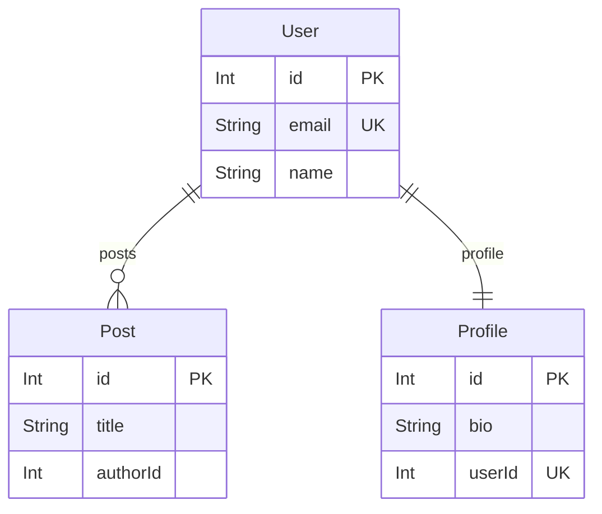

# prisma-neighbourhood

Generate focused ERD diagrams from Prisma schemas by traversing relationships from any model to a configurable depth.

[](https://github.com/Matserdam/prisma-neighbourhood/actions/workflows/ci.yml)

[](https://github.com/Matserdam/prisma-neighbourhood/actions/workflows/release.yml)

## Why?

Large Prisma schemas with 50+ models produce overwhelming ERDs. `prisma-neighbourhood` lets you visualize just the "neighborhood" around a specific model — perfect for onboarding, impact analysis, and architecture documentation.

## Quick Start

```bash
# Visualize relationships around User model
npx prisma-hood -s ./prisma/schema.prisma -m User

# Export as PNG
npx prisma-hood -s ./prisma/schema.prisma -m User -o erd.png

# Limit to direct relationships only
npx prisma-hood -s ./prisma/schema.prisma -m User -d 1
```

## Installation

```bash
# Run without installing (recommended)
npx prisma-neighbourhood [options]
npx prisma-hood [options]        # short alias
bunx prisma-hood [options]       # for Bun users

# Or install globally
npm install -g prisma-neighbourhood
```

## CLI Options

| Option | Alias | Description | Default |
|--------|-------|-------------|---------|
| `--schema <path>` | `-s` | Path to Prisma schema file | required |
| `--model <name>` | `-m` | Model to start traversal from | required |
| `--depth <n>` | `-d` | Relationship levels to traverse | 3 |
| `--output <file>` | `-o` | Output file (.mmd, .md, .png, .pdf) | stdout |
| `--renderer <name>` | `-r` | Diagram renderer | mermaid |

## Output Formats

| Extension | Format | Use Case |
|-----------|--------|----------|
| `.mmd` | Mermaid syntax | Embed in markdown, VS Code preview |
| `.png` | PNG image | README, Confluence, presentations |
| `.pdf` | PDF document | Print, formal documentation |

## Example Output



## Use Cases

**Onboarding** — Show new developers just one domain without the full schema overwhelming them

**Impact Analysis** — See what models are affected within N hops before making changes

**Domain-Driven Design** — Visualize bounded contexts around aggregate roots

**Microservice Decomposition** — Identify which models cluster together

**Documentation** — Keep ERDs in sync with your actual schema

## Documentation

- [LLM Documentation](docs/llm/prisma-neighbourhood.md) — Detailed usage guide
- [CI/CD & Release](docs/ci-and-release.md) — Workflows and publishing

## Development

```bash
cd sources/prisma-neighbourhood
bun install
bun run build
bun run test
```

## License

MIT

