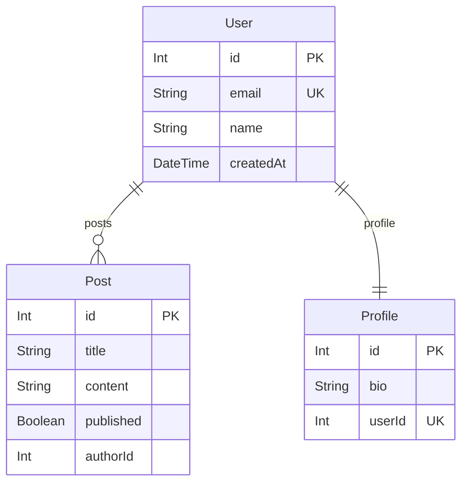

# prisma-neighbourhood

Generate focused ERD diagrams from Prisma schemas by traversing relationships from any model to a configurable depth.

## Installation

### Run without installing (recommended)

```bash
npx -y @matserdam/prisma-neighborhood [options]
npx -y --package @matserdam/prisma-neighborhood prisma-hood [options]
bunx --package @matserdam/prisma-neighborhood prisma-hood [options]
```

### Install globally

```bash
npm install -g @matserdam/prisma-neighborhood
```

## Quick Start

```bash
# Visualize the neighborhood around User model
npx -y --package @matserdam/prisma-neighborhood prisma-hood -s ./prisma/schema.prisma -m User

# Show only direct relationships (depth 1)
npx -y --package @matserdam/prisma-neighborhood prisma-hood -s ./prisma/schema.prisma -m User -d 1

# Export as PNG for documentation
npx -y --package @matserdam/prisma-neighborhood prisma-hood -s ./prisma/schema.prisma -m User -o docs/erd.png
```

## CLI Options

| Option | Alias | Description | Default |
|--------|-------|-------------|---------|
| `--schema <path>` | `-s` | Path to Prisma schema file | required |
| `--model <name>` | `-m` | Model to start traversal from | required |
| `--depth <n>` | `-d` | Number of relationship levels to traverse | 3 |
| `--output <file>` | `-o` | Output file (.mmd, .md, .png, .pdf) | stdout |
| `--renderer <name>` | `-r` | Diagram renderer to use | mermaid |
| `--list-renderers` | | Show available renderers | |
| `--help` | `-h` | Show help | |
| `--version` | `-V` | Show version | |

## Output Formats

| Extension | Format | Use Case |
|-----------|--------|----------|
| `.mmd` | Mermaid syntax | Embed in markdown, preview in VS Code, use mermaid.live |
| `.md` | Mermaid syntax | Same as .mmd |
| `.png` | PNG image | README badges, Confluence, presentations, Slack |
| `.pdf` | PDF document | Print, formal architecture documentation |

## Example Output

Given a Prisma schema with User, Post, and Profile models, running:

```bash
npx -y --package @matserdam/prisma-neighborhood prisma-hood -s schema.prisma -m User -d 2
```

Produces Mermaid ERD syntax:



## Examples by Use Case

### Onboarding: Show a new developer just one domain

```bash
# Authentication domain only, not the full 200-model schema
npx -y --package @matserdam/prisma-neighborhood prisma-hood -s schema.prisma -m User -d 2 -o docs/auth-domain.png

# Order processing domain for new backend developer
npx -y --package @matserdam/prisma-neighborhood prisma-hood -s schema.prisma -m Order -d 2 -o docs/orders-domain.png
```

### Stakeholder communication: Generate diagrams for non-technical audience

```bash
npx -y --package @matserdam/prisma-neighborhood prisma-hood -s prisma/schema.prisma -m Product -d 2 -o slides/product-model.png
npx -y --package @matserdam/prisma-neighborhood prisma-hood -s prisma/schema.prisma -m Customer -d 2 -o slides/customer-model.pdf
```

### Impact analysis: See what models are affected by a change

```bash
# Before modifying User, see everything within 2 hops
npx -y --package @matserdam/prisma-neighborhood prisma-hood -s schema.prisma -m User -d 2

# Check impact radius of Invoice changes
npx -y --package @matserdam/prisma-neighborhood prisma-hood -s schema.prisma -m Invoice -d 2 -o impact-analysis.png
```

### Code review: Visualize models touched by a PR

```bash
# PR touches Order, OrderItem, Payment - see how they connect
npx -y --package @matserdam/prisma-neighborhood prisma-hood -s schema.prisma -m Order -d 1 -o pr-context.png
```

### Domain-Driven Design: Identify bounded context boundaries

```bash
# Visualize neighborhood around each aggregate root
npx -y --package @matserdam/prisma-neighborhood prisma-hood -s schema.prisma -m Order -d 3 -o contexts/order-aggregate.mmd
npx -y --package @matserdam/prisma-neighborhood prisma-hood -s schema.prisma -m User -d 3 -o contexts/user-aggregate.mmd
npx -y --package @matserdam/prisma-neighborhood prisma-hood -s schema.prisma -m Product -d 3 -o contexts/product-aggregate.mmd
```

### Check coupling: Does adding a relation create unwanted dependencies?

```bash
# Before: visualize Order neighborhood
npx -y --package @matserdam/prisma-neighborhood prisma-hood -s schema.prisma -m Order -d 2 -o before.mmd

# After adding relation: check if UserPreferences now appears
npx -y --package @matserdam/prisma-neighborhood prisma-hood -s schema.prisma -m Order -d 2 -o after.mmd
```

### Microservice decomposition: See what models cluster together

```bash
# What belongs in the Order service?
npx -y --package @matserdam/prisma-neighborhood prisma-hood -s schema.prisma -m Order -d 3 -o services/order-service.png

# What belongs in the User service?
npx -y --package @matserdam/prisma-neighborhood prisma-hood -s schema.prisma -m User -d 3 -o services/user-service.png

# Compare outputs to identify shared models (potential API boundaries)
```

### Database migration planning: Understand table dependencies

```bash
# What tables cascade from Product?
npx -y --package @matserdam/prisma-neighborhood prisma-hood -s schema.prisma -m Product -d 3

# Plan migration order based on relationship graph
npx -y --package @matserdam/prisma-neighborhood prisma-hood -s schema.prisma -m Inventory -d 2 -o migration-scope.png
```

### Documentation: Keep ERDs in sync with actual schema

```bash
# Regenerate focused diagrams from current schema
npx -y --package @matserdam/prisma-neighborhood prisma-hood -s prisma/schema.prisma -m User -o docs/user-erd.png
npx -y --package @matserdam/prisma-neighborhood prisma-hood -s prisma/schema.prisma -m Order -o docs/order-erd.png

# Generate Mermaid for embedding in README
npx -y --package @matserdam/prisma-neighborhood prisma-hood -s prisma/schema.prisma -m Post -o README-diagram.mmd
```

### CI/CD: Automated documentation generation

```yaml
# In GitHub Actions workflow
- name: Generate ERD documentation
  run: |
    npx -y --package @matserdam/prisma-neighborhood prisma-hood -s prisma/schema.prisma -m User -d 3 -o docs/generated/user-erd.png
    npx -y --package @matserdam/prisma-neighborhood prisma-hood -s prisma/schema.prisma -m Order -d 3 -o docs/generated/order-erd.png
```

## Understanding Depth

The `--depth` flag controls how many relationship levels to traverse from the starting model.

| Depth | What it shows |
|-------|---------------|
| 1 | Start model + directly related models only |
| 2 | Above + models related to those (2 hops) |
| 3 | Default. Good balance for most schemas |
| 4-5 | Deep exploration, may get large |

**Example**: User → Post → Comment → Author

| Depth | Models shown |
|-------|--------------|
| 1 | User, Post |
| 2 | User, Post, Comment |
| 3 | User, Post, Comment, Author |

**Recommendations**:
- Use `depth=1` for focused impact analysis
- Use `depth=2-3` for domain understanding
- Use `depth=4+` for exploring complex interconnections

## Platform Compatibility

| Platform | PNG/PDF Export | Notes |
|----------|----------------|-------|
| macOS | ✅ Works | No setup needed |
| Windows | ✅ Works | No setup needed |
| Linux | ⚠️ Requires deps | See troubleshooting |
| Docker | ⚠️ Requires deps | Use node:18-bullseye base image |

## Troubleshooting

### PNG/PDF export fails on Linux

PNG and PDF export requires Chromium. Install dependencies:

```bash
# Debian/Ubuntu
sudo apt-get install libnss3 libatk1.0-0 libatk-bridge2.0-0 libcups2 \
  libdrm2 libxkbcommon0 libxcomposite1 libxdamage1 libxrandr2 libgbm1 \
  libasound2 libpangocairo-1.0-0 libgtk-3-0

# Alpine
apk add chromium
```

**Alternative**: Output to `.mmd` and use [mermaid.live](https://mermaid.live) or VS Code with Mermaid extension.

### Model not found error

Model names are case-sensitive. Check exact spelling in your schema.prisma:

```prisma
model User { ... }    // Use: -m User
model OrderItem { }   // Use: -m OrderItem (not orderitem)
```

### Diagram shows too many models

Reduce depth to limit scope:

```bash
# Too much? Try depth 1 for direct relations only
npx -y --package @matserdam/prisma-neighborhood prisma-hood -s schema.prisma -m User -d 1
```

If still too large, your model may be a "God object" with too many relations — consider refactoring.

### Output is empty or missing models

Ensure the model has relations defined in your schema. Scalar-only models produce minimal output showing just that model's fields.

