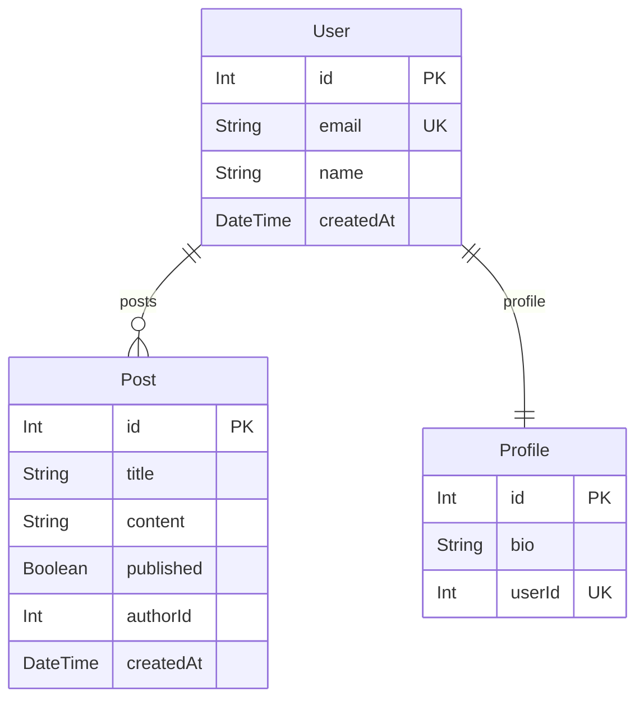

# prisma-subgraph-cli

CLI tool that generates Entity-Relationship Diagrams from Prisma schemas, starting from a specified model and traversing relationships to a configurable depth.

## Installation

```bash
bun install
```

## Usage

```bash
# Basic usage - generate ERD starting from User model (stdout)
bun src/index.ts -s ./prisma/schema.prisma -m User

# With custom depth (default is 3)
bun src/index.ts -s ./prisma/schema.prisma -m User -d 5

# Output to Mermaid file
bun src/index.ts -s ./prisma/schema.prisma -m User -o diagram.mmd

# Export to PNG
bun src/index.ts -s ./prisma/schema.prisma -m User -o diagram.png

# Export to PDF
bun src/index.ts -s ./prisma/schema.prisma -m User -o diagram.pdf

# List available renderers
bun src/index.ts --list-renderers

# Show help
bun src/index.ts --help
```

## Options

| Option | Alias | Description | Default |
|--------|-------|-------------|---------|
| `--schema <path>` | `-s` | Path to the Prisma schema file | (required) |
| `--model <name>` | `-m` | Name of the model to start traversal from | (required) |
| `--depth <n>` | `-d` | Traversal depth | 3 |
| `--renderer <name>` | `-r` | Diagram renderer | mermaid |
| `--output <file>` | `-o` | Output file (stdout if omitted) | - |
| `--list-renderers` | - | Show available renderers | - |
| `--help` | `-h` | Display help | - |
| `--version` | `-V` | Output version | - |

### Output Formats

The output format is determined by the file extension:

| Extension | Format |
|-----------|--------|
| `.mmd` | Mermaid text |
| `.md` | Mermaid text |
| `.png` | PNG image |
| `.pdf` | PDF document |

## Example Output

Given a Prisma schema with User, Post, and Profile models:



## Development

```bash
# Run tests
bun test

# Type check
bun run typecheck

# Watch tests
bun test:watch
```

## Architecture

The tool is built with a pluggable renderer system:

```
┌─────────────┐     ┌────────────┐     ┌───────────────────┐
│ Schema File │ ──▶ │   Parser   │ ──▶ │   Model Traverser │
└─────────────┘     └────────────┘     └───────────────────┘
                                                │
                                                ▼
                    ┌────────────┐     ┌───────────────────┐
                    │   Output   │ ◀── │ Diagram Renderer  │
                    └────────────┘     └───────────────────┘
```

### Adding a New Renderer

1. Implement the `DiagramRenderer` interface:

```typescript
import type { DiagramRenderer, ExportFormat } from "./renderer/types";

export class MyRenderer implements DiagramRenderer {
  readonly name = "myrenderer";
  readonly description = "My custom renderer";

  render(models: readonly TraversedModel[]): string {
    // Generate diagram syntax
  }

  supportsExport(): boolean {
    return false;
  }
}
```

2. Register it in the registry:

```typescript
import { rendererRegistry } from "./renderer";
import { MyRenderer } from "./my-renderer";

rendererRegistry.register({
  renderer: new MyRenderer(),
});
```

## License

MIT
